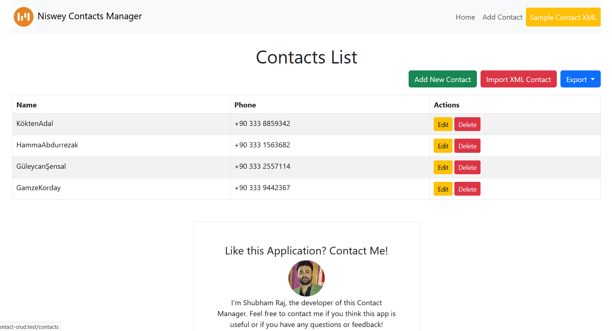

<p align="center"><a href="https://laravel.com" target="_blank"></a></p>

# Niswey Contact Manager

This is a **Contact Manager** web application built using the **Laravel Framework**. It allows users to manage their contacts, import contacts in bulk via XML, and export contacts to CSV or XML formats.



## Features

- **CRUD Operations**:  
  Users can **Create**, **Read**, **Update**, and **Delete** contacts from the application.

- **Bulk Import**:  
  Users can import contacts in bulk using **XML** files.

- **Export Contacts**:  
  Users can export contacts to **CSV** or **XML** formats.

- **Confirmation Modals**:  
  Confirmation modals are used for actions like **deleting contacts**.

- **Responsive Design**:  
  The application uses **Bootstrap** for responsive design, ensuring it looks good on all devices.

## Prerequisites

Before you start, ensure you have the following installed:

- **PHP** (>= 8.0)
- **Composer** (for managing PHP dependencies)
- **Laravel** (latest version compatible with your PHP setup)
- **MySQL** (or any other database)

## Installation Steps

### Step 1: Clone the repository

Clone the repository from GitHub:

```bash
git clone https://github.com/shubhamrajprajapati/niswey_contact_crud.git
cd niswey_contact_crud
```
### Step 2: Install dependencies

Run the following command to install all the required dependencies:

```bash
composer install
```

### Step 3: Set up your environment

Copy the `.env.example` file and rename it to `.env`:

```bash
cp .env.example .env
```

Edit the `.env` file and configure the database connection. Here's an example using MySQL:

```bash
DB_CONNECTION=mysql
DB_HOST=127.0.0.1
DB_PORT=3306
DB_DATABASE=niswey_contact_manager
DB_USERNAME=root
DB_PASSWORD=
```

### Step 4: Generate the application key

Run the following command to generate the Laravel application key:

```bash
php artisan key:generate
```

### Step 5: Migrate the database

Run the database migrations to create the necessary tables:

```bash
php artisan migrate
```

### Step 6: Serve the application

Start the Laravel development server:

```bash
php artisan serve
```
The application will be accessible at `http://localhost:8000`.

## Features in Detail

### 1. Managing Contacts (CRUD)

You can easily **Add**, **Edit**, and **Delete** contacts within the application.

- **Add Contacts**: 
  Users can create new contacts by entering a **name**, and **phone number**. These details are stored in the database.

- **Edit Contacts**: 
  Existing contacts can be modified. Users can update any details (name, phone number) and save the changes.

- **Delete Contacts**: 
  Contacts can be deleted with a single click. Deleting contacts is protected with a **confirmation modal** (explained below) to prevent accidental deletions.

Each contact has the following fields:
- **Name**: The name of the contact.
- **Phone Number**: The contact's phone number.

### 2. Bulk Import Contacts

You can **import contacts in bulk** via an **XML file**.

- The XML file should follow a specific structure to be processed correctly. Each contact's data should be wrapped in an individual XML element.
- The application parses the XML file, extracts contact details, and adds them to the contact list in the database.

Example XML structure:

```xml
<contacts>
  <contact>
    <name>John Doe</name>
    <phone>123456789</phone>
    <email>john.doe@example.com</email>
  </contact>
  <contact>
    <name>Jane Smith</name>
    <phone>987654321</phone>
    <email>jane.smith@example.com</email>
  </contact>
</contacts>
```
### 3. Export Contacts (CSV & XML)

You can export your contacts to **CSV** or **XML** files.

- **CSV Export**:  
  Contacts can be exported in **CSV** format, which can be opened in spreadsheet applications like Microsoft Excel or Google Sheets.
  
- **XML Export**:  
  Alternatively, contacts can be exported in **XML** format, which can be used in other applications or for data processing.

Both export options provide the user with an easy way to backup their contacts or use the data in other applications.

### 4. Delete Confirmation

Deleting a contact is protected by a **confirmation modal** to avoid accidental deletions.

- **Confirmation Modal**:  
  When the user clicks the **Delete** button, a modal will pop up asking them to confirm their decision.

This step ensures that users do not accidentally delete contacts without intention. If they confirm, the contact will be deleted from the database.

## Code of Conduct

In order to ensure that the Laravel community is welcoming to all, please review and abide by the [Code of Conduct](https://laravel.com/docs/contributions#code-of-conduct).

## License

The Laravel framework is open-sourced software licensed under the [MIT license](https://opensource.org/licenses/MIT).
